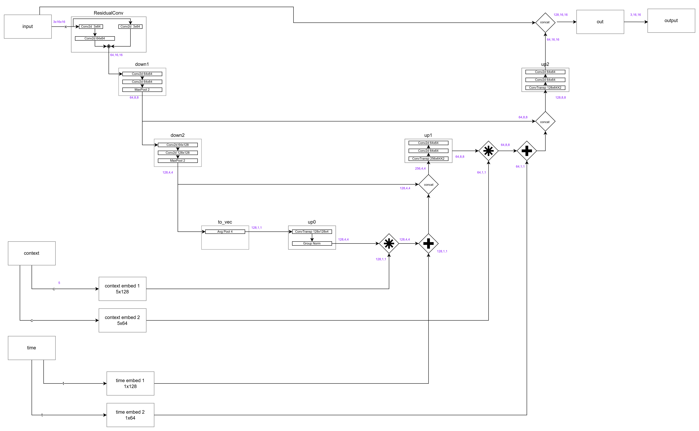
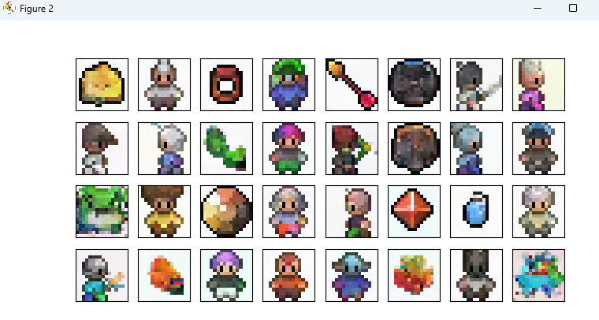
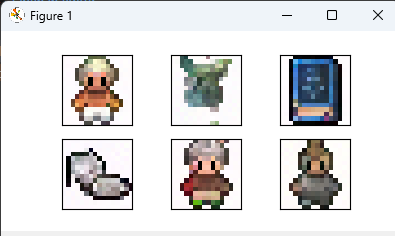

# sprites generator

Play-code on the generation of sprites based on a context.
The code is based on the fantastic deeplearning.ai course https://learn.deeplearning.ai/courses/diffusion-models. I really recommend it for anybody interested in deep-learning and image generation.

## The model
The schematic of the model, employed for learning and generation, looks like this:

To run the code, make sure you have installed pytorch and numpy.

The context of the sprites is limited to an embedding vector of 5:
1. is the sprite a hero
2. is the sprinte a non-hero
3. is the sprite food
4. is the sprite refering to a spell
5. is the sprite side-facing. 1 for sidefacing, 0 for frontfacing

So a context vector of [1,0,0.5,0,0] would generate a sprite that is a hero but also bit (0.5) of a food.

## Using pre-trained weigths.
The simple-est way to go is using pretrained weights. Use code like this:
<code>
from pipeline import Pipeline

pl = Pipeline()
pl.load_data()
pl.load_pretraining()
pl.visualise_random_sample()
</code>

to show:

## Using pre-trained weights with context.
Use code like this to generate:
1. A sprite of a hero
2. A sprite of a hero but also a bit of food
3. 2 sprites of spells
4. 2 sprites of a hero but also a bit of a spell
<code>
from pipeline import Pipeline

pl = Pipeline()
pl.load_data()
pl.load_pretraining()
matrix = [
    # hero, non-hero, food, spell, side-facing
    [1, 0, 0,   0,   0],      
    [1, 0, 0.6, 0,   0],
    [0, 0, 0,   1,   0],
    [0, 0, 0,   1,   0],
    [1, 0, 0,   0.6, 0],
    [1, 0, 0,   1,   0]
]
pl.visualise_context_sample(matrix)
</code>

to show:

## To train
Use the following code to train. The epoch number is parameter for the train() method.
If you run this on windows on a CPU, it will take some time :-)

The training will write weights in the /weights directory.

<code>
from pipeline import Pipeline

pl = Pipeline()
pl.load_data()
pl.load_pretraining()
pl.train(32)
</code>

after training you can load the training with:
<code>
pl.load_pretraining(self, filename="context_model")
</code>

and use pl.visualise_random_sample() and visualise_context_sample() to visualisation